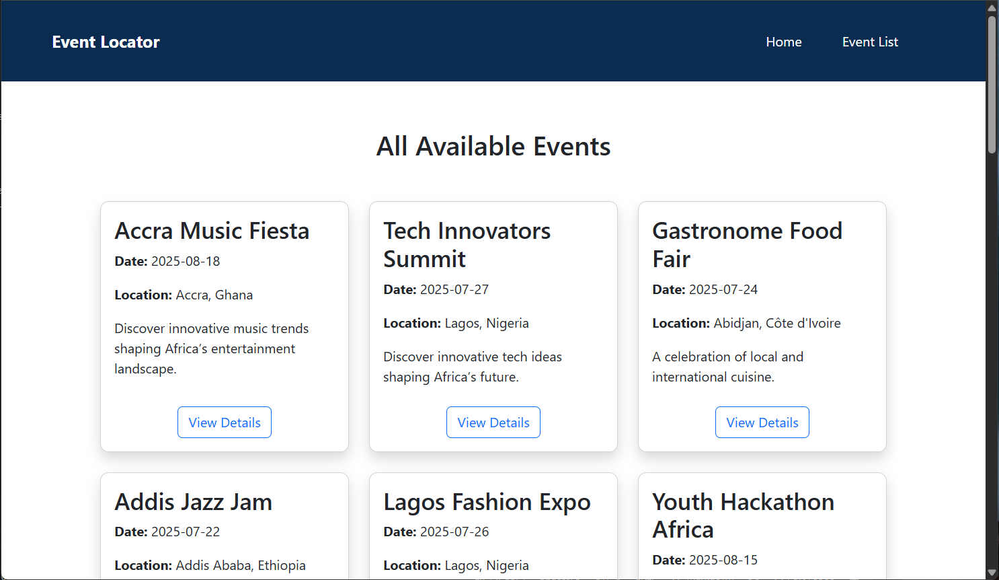

# Event Locator

Event Locator is a lightweight, mobile-friendly web app that helps users discover upcoming events across various cities in Africa. Users can search by city or event name, filter by date or category, and view detailed information for each event.

---

## Preview

1. Homeage
- 

2. Event List - All
- 

3. Filtered Events (using "Tech" as the keyword)
- 

4. Search criteria not matching any event(s)
- 

5. Details of a select event
- 

---

## Features

- **Search Events** by city or event name
- **Filter Events** by date and category (e.g. Tech, Music, Film)
- **Dynamic Event Listing** pulled from a `JSON` file
- **Event Detail View** with description, location, date, and category
- **Responsive Design** (Bootstrap-based + Custom CSS) with mobile-friendly navigation
- **Accessible Hamburger Menu** that toggles with click and closes when clicking outside

---

## Project Structure
```bash
event-locator-challenge-Darlington6/
│
├── css/
│ └── styles.css
|
├── data/
│ └── events.json
|
├── js/
│ ├── details.js
│ ├── hamburger.js
│ └── search.js
|
├── screenshots
|     ├── event-details.png
|     ├── event-list-all.png
|     ├── filtered-events.png
|     ├── homepage.png
|     └── no-match.png
|
├── assignment_resources.md
├── event-details.html
├── events.html
├── index.html 
│
└── README.md
```
---

## Setup Instructions

> This is a static web project — no server or framework required.

1. **Clone the repository**
   ```bash
   git clone https://github.com/ALU-BSE/event-locator-challenge-Darlington6.git

   cd event-locator
   ```
2. Open `index.html` in your browser.

- You can also use Live Server in VS Code for better development experience.

- Ensure all files maintain the relative structure (especially events.json and JS/CSS assets).

---

## Notes
- All event data is sourced from data/events.json

- Categories used include: Music, Tech, Food, Fashion, Sports, Film, Climate, Literature, Health

- Footer and Navbar are reusable across pages

- Accessibility: Semantic HTML elements with aria-label, aria-live, and keyboard-friendly navigation

## Author
Desmond Tunyinko